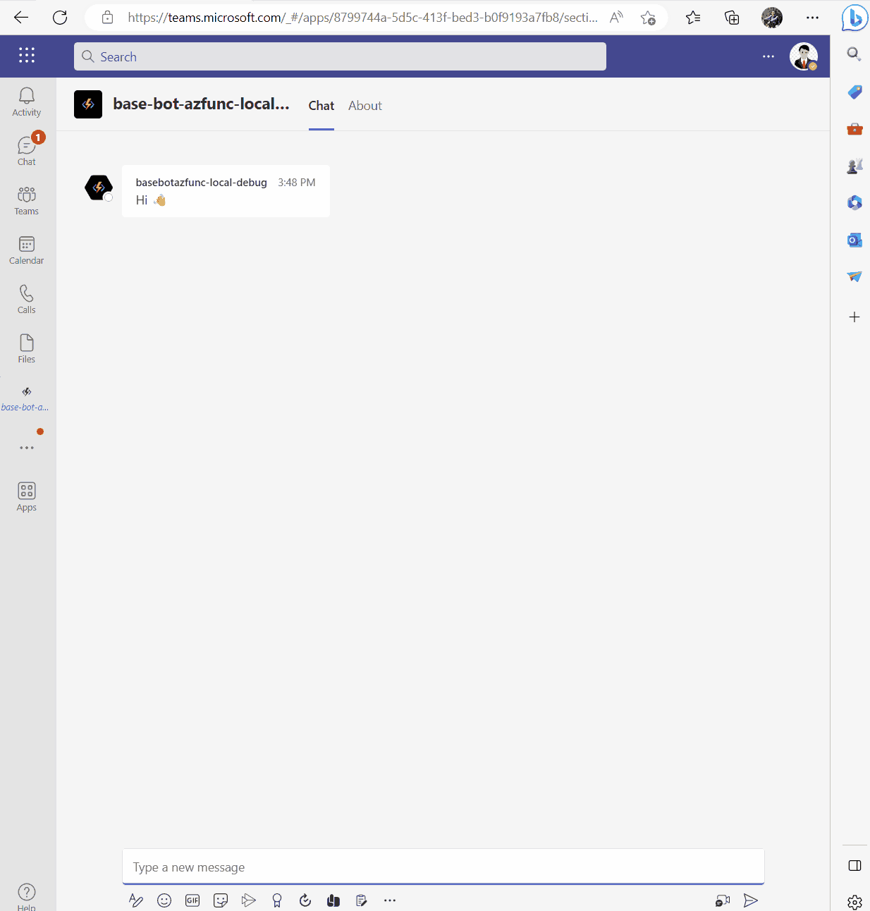

# Microsoft Teams Azure Function Bot Sample

<video src="https://user-images.githubusercontent.com/11563347/222792027-76b1025c-eb0c-4b18-b399-0b67269dbdf7.mp4" data-canonical-src="https://user-images.githubusercontent.com/11563347/222792027-76b1025c-eb0c-4b18-b399-0b67269dbdf7.mp4" controls="controls" muted="muted" class="d-block rounded-bottom-2 border-top width-fit" style="max-height:640px; min-height: 200px">
  </video>


This sample uses TypeScript, Azure Functions and Teams Toolkit for Visual Studio Code.

It aims to provide the basis of a skeleton project that demonstrates common bot features.

- Send proactive messages
- Send welcome message
- Use bot commands
- Capture user input
- Persist bot state

Bots can use interactive cards, so it shows how to send:

- An Adaptive Card form to all bot install locations
- An Adaptive Card form to a specific person
- An Adaptive Card form using a bot command

Bots can capture user input, so its how to:

- Get user input from an Adaptive Card form
- Replace Adaptive Card form on form submit

Bots are stateful, so it shows how to:

- Use Azure Storage for notification state
- Use Azure Storage for conversation state
- Clear state using `/` command
- Get and update state values

Bots can be friendly, so it shows how to:

- Send a welcome message to new users

## Prerequisites

To run this sample you will need access to:

- Microsoft 365 tenant with uploading custom apps enabled
- Microsoft 365 account with admin permissions

> Or use a Microsoft 365 Developer Tenant. [Join the program today!](https://developer.microsoft.com/microsoft-365/dev-program?WT.mc_id=m365-90825-garrytrinder)

You will also need the following installed on your machine:

- [Visual Studio Code](https://code.visualstudio.com/)
- [Teams Toolkit v4.2.x](https://marketplace.visualstudio.com/items?itemName=TeamsDevApp.ms-teams-vscode-extension)
- [nodejs LTS](https://nodejs.org/)

## Run the sample

1. Clone this repository
2. Open the folder in Visual Studio Code
3. Start a debug session, press F5 or use the Debug and Run panel
4. Follow the on-screen steps to authenticate and add app to Microsost Teams.
5. Stop debug session
6. Update variables in `bot\src\.env.teamsfx.local`
```
BLOB_CONNECTION_STRING=UseDevelopmentStorage=true
BLOB_CONTAINER_NAME_NOTIFICATIONS=notifications
BLOB_CONTAINER_NAME_STATE=state
```
7. Start a new debug session, follow steps.
8. Test the sample!

## Test the sample

Send an Adaptive Card form to all install locations:

```http
POST https://localhost:3798/api/notification
```

Send an Adaptive Card form to an specific person:

```http

POST https://localhost:3798/api/notification?upn=user@domain.com
```

Post an Adaptive Card form using a command:

Send a message in the chat with the word `form`.

Clear state:

Send a message in the chat with the word `/clear`.

## Further reading

- [Teams Toolkit overview](https://learn.microsoft.com/microsoftteams/platform/toolkit/teams-toolkit-fundamentals?pivots=visual-studio-code&WT.mc_id=m365-90825-garrytrinder)
- [Build bots for Teams](https://learn.microsoft.com/en-us/microsoftteams/platform/bots/what-are-bots?WT.mc_id=m365-90825-cxa)
- [Send notification to Teams](https://github.com/OfficeDev/TeamsFx/wiki/Send-notification-to-Teams)
- [Respond to chat commands in Teams](https://github.com/OfficeDev/TeamsFx/wiki/Respond-to-chat-commands-in-Teams)
- [Respond to card actions in Teams](https://github.com/OfficeDev/TeamsFx/wiki/Respond-to-card-actions-in-Teams)
- [Designing adaptive cards for your Microsoft Teams app](https://learn.microsoft.com/en-us/microsoftteams/platform/task-modules-and-cards/cards/design-effective-cards?tabs=design&WT.mc_id=m365-90825-cxa)


## SSO feature screenshot


## Quick steps about how to support sso
- Add [aad.template.json](./templates/appPackage/aad.template.json)
- Update [manifest.template.json](./templates/appPackage/manifest.template.json) file
- Update [projectSettings.json](./.fx/configs/projectSettings.json)
- Update [tasks.json](./.vscode/tasks.json)
- Add `authPageHandler` to host `auth-start` and `auth-end` page
- Update code inside src folder
- update [package.json](./bot/package.json) file to copy public folder to `dist` folder

All above changes can be found in this commit: https://github.com/SLdragon/msteams-base-bot-azfunc/commit/fbf623d0f1cbf74c22a97913e5f9963ee2416ca3

## Current limitations
- TeamsFx currently doesn't support sso adaptive card action, this sample project uses the [modified teamsfx sdk](./bot/src/sdk/) in source folder to implement sso feature

- Current sso adaptive card implementation doesn't support group chat

- In the future maybe several month later, we will support sso adaptive card feature based on latest adaptive card sso feature here: https://learn.microsoft.com/en-us/microsoftteams/platform/task-modules-and-cards/cards/universal-actions-for-adaptive-cards/enable-sso-for-your-adaptive-cards-universal-action 


